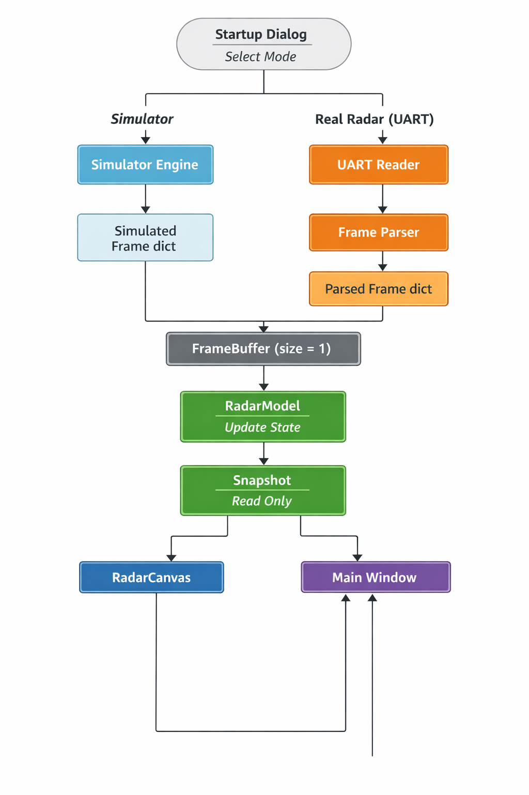

# RadarGUI – Realtime Radar Visualization & Simulator

## 1. Giới thiệu

**RadarGUI** là ứng dụng hiển thị radar thời gian thực, hỗ trợ:

- Radar giả lập (Simulator)
- Radar thật qua UART (STM32 / MCU)
- Hiển thị PPI radar (đường quét, lưới, mục tiêu, marker)
- Hoạt động ổn định 24/7 trên Raspberry Pi 4

Ứng dụng được thiết kế để chạy trên **2 môi trường**:

- **PC (Windows / Linux x86)** → PyQt6 (phát triển, debug)
- **Raspberry Pi 4** → PyQt5 (triển khai thực tế)

👉 **Không cần viết lại code khi chuyển từ PC sang Pi**.

---

## 2. Kiến trúc tổng thể
## Runtime Architecture (Simulator & Real Radar)




Nguyên tắc thiết kế

    Model là ranh giới thread

    UI không đọc dữ liệu trực tiếp từ UART

    Mọi nguồn dữ liệu → frame chuẩn → buffer → model

    Frame cũ bị drop, chỉ hiển thị trạng thái mới nhất (đúng với radar)
## 3. Tính năng chính

### 3.1. Hiển thị radar
- Đường quét (sweep) quay liên tục
- Lưới radar theo range mode
- Hiển thị mục tiêu
- Marker tương tác bằng chuột
- Auto-scale + hysteresis

### 3.2. Simulator
- Thêm / xóa mục tiêu
- Điều chỉnh:
  - góc ban đầu
  - cự ly
  - tốc độ
  - hướng bay
- Điều khiển:
  - START / STOP
  - TX ON / OFF (toggle)
  - Sweep angle
  - Sweep speed (0–16 deg/s)
- Reset simulator về trạng thái ban đầu

### 3.3. Radar thật (UART)
- Đọc UART bất đồng bộ
- Parse frame nhị phân
- Ghi vào buffer giống simulator
- Không block UI

---

## 4. Chuẩn dữ liệu Frame (Frame Contract)

RadarModel nhận **frame chuẩn** dạng Python dict:

```python
frame = {
    "angle": float,         # góc quét hiện tại (deg)
    "speed": float,         # tốc độ quét (deg/s)
    "range_mode": int,      # mode tầm xa
    "ranges": list[float], # danh sách mục tiêu (km)
    "power": list[float],  # cường độ (optional)
    "status": {
        "tx_on": bool
    }
}
Simulator và UART phải tạo frame đúng cấu trúc này.